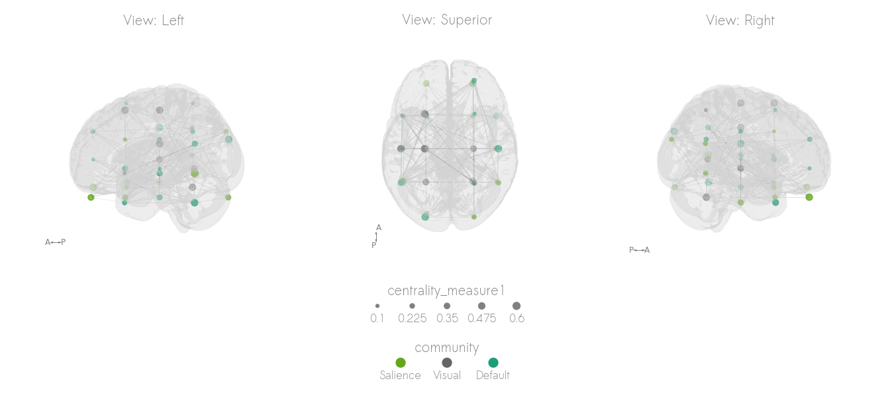
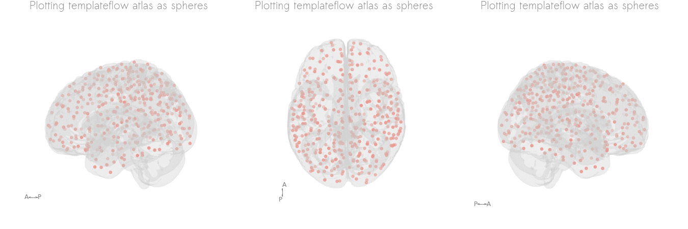

# netplotbrain: visualizing networks on a brain

A package to create simple 3D network visualizations of networks on a brain.

(Name is a work in progress)


# Installation

`pip install git+https://www.github.com/wiheto/netplotbrain`

# How it works

There are three components: (1) the nodes, (2) the edges, (3) the template

Each component functions independently.
You do not need to have all of them specified.

# Nodes

There are three ways to specify nodes.

1. a pandas dataframe of cordinates
2. a 3D nifti image where each node has a different value.
3. a dictionary to grab an atlas from templateflow.

# Dataframe

The Pandas dataframe should have(at least) the columns 'x', 'y', and 'z'.
These columns should be coordinates in the space of the template(e.g. MNI).

Other columns can be used to style the node's colour and size(`nodecolor`, `nodesize`).
So for example, if you have a column called "communities" in your pandas dataframe
you can type:

```netplotbrain.plot(..., nodecolor='communities')```

These additional values to specify size and color can be given as a dataframe even
if you specify your nodes with a nifti image.

# Nifti image

You can also input a 3D nifti image where each node is a unique value.

# Templateflow atlas

If you specify the key/value pairs of an atlas on templateflow in a dictionary,
the atlas will be automatically downloaded.

# For the edges

Edges as a numpy array(adj matrix) or as a pandas dataframe(edgelist) with the columns 'i', 'j', and 'weight' (optional).

# For the template

For the template you can supply any nifti file.
However, you can just provide the template name for any template on templateflow.org.
The T1w brain mask will then automatically downloaded(if not already present on your computer) and used as the background.

# Template Styles

There are currently two background styles: "filled" and "cloudy".

The filled style, plots the template's brain mask as voxels.

The cloudy style, tries to identify the outline of the mask.
The cloudy style is quicker, but the edge detection is run relative to the specified initial view of the plot.

For both templates, you can change the voxelsize of the template. Larger voxels means the plot will be generated quicker

# Views

The view is the angle which the brain is viewed from in the plot.
You can specify it as a string:

- Left 'L',
- Right 'R',
- Anterior 'A',
- Posterior 'P'
- Superior 'S'
- Inferior 'I'

Sequences of views are possible.
So setting view = 'LSR' will generate 3 subplots with left, superior, and right views

You can also specify the specific rotation(tuple): (xy-rotate, xz-rotate) in degrees. The R view is (0, 0)

# Rotated view sequences

You can also generate a sequence of rotated images.

If the view is two letters, (e.g. `'LR'`), then a sequence will be generated from the L-view to R-view.

The parameter `frames` will controle how many images are generated.
Images will then be displayed along a single row.

If you specify a list(e.g. `['LR', 'AP']`) then two different rows will be generated.
The first, from left to right. The second from anterior to posterior.

# Minimal examples

# Generate some random data for examples

```python

import numpy as np
import netplotbrain
import pandas as pd
import matplotlib.pyplot as plt
# Set random seed
np.random.seed(2021)

n = 10  # number of nodes
m = 20  # number of edges

# CREATE THE NODES
# 8 psudeorandom xyz coordinates
X = np.random.uniform(-50, 50, n)
y = np.random.uniform(-90, 60, n)
z = np.random.uniform(-40, 50, n)
# Some random centrality measures to demonstrate size
centrality_measure1 = np.random.binomial(10, 0.3, n) / 10
centrality_measure2 = np.random.binomial(10, 0.6, n) / 10
nodesdf = pd.DataFrame(data={'x': X, 'y': y,
                           'z': z, 'centrality_measure1': centrality_measure1,
                           'centrality_measure2': centrality_measure2})

## CREATE THE EDGES.
# Randomly selet edges 
ind = np.triu_indices(n, k=1)
eon = np.random.permutation(len(ind[0]))
edges = np.zeros([n, n])
# Generate some random wieghts between 0 and 1
weights = np.random.binomial(10, 0.25, m) / 10
edges[ind[0][eon[:m]], ind[1][eon[:m]]] = weights
# Make symetrical
edges += edges.transpose()
```

# Plot single view

```python
netplotbrain.plot(template='MNI152NLin2009cAsym',
                  templatestyle='surface',
                  view='R',
                  nodes=nodes,
                  nodesize='centrality',
                  edges=edges)
plt.show()
```


# Specify column names to specify size

```python
netplotbrain.plot(template='MNI152NLin2009cAsym',
                  templatestyle='surface',
                  view='R',
                  nodes=nodes,
                  nodesize='betweenness',
                  nodecolor='blue',
                  edges=edges)
plt.show()
```


# Plot different styles

```python
netplotbrain.plot(template='MNI152NLin2009cAsym',
                  templatestyle='filled',
                  view='R',
                  nodes=nodes,
                  nodesize='centrality',
                  edges=edges)
plt.show()
```


```python
netplotbrain.plot(template='MNI152NLin2009cAsym',
                  templatestyle='cloudy',
                  view='R',
                  nodes=nodes,
                  nodesize='centrality',
                  edges=edges)
plt.show()
```


# Plot sequence

```python
netplotbrain.plot(template='MNI152NLin2009cAsym',
                  templatestyle='cloudy',
                  view='RP',
                  nodes=nodes,
                  nodesize='centrality',
                  edges=edges,
                  frames=3)
plt.show()
```


# Plot multiple rows

```python
netplotbrain.plot(template='MNI152NLin2009cAsym',
                  templatestyle='surface',
                  nodes=nodes,
                  nodesize='centrality',
                  edges=edges,
                  view=['LSR', 'AIP'],
                  frames=2)
plt.show()
```


# Plot atlas (as nodes) from templateflow

```python
netplotbrain.plot(nodeimg={'atlas': 'Schaefer2018',
                            'desc': '400Parcels7Networks',
                            'resolution': 1},
                  template='MNI152NLin2009cAsym',
                  templatestyle='surface',
                  view=['LSR'],
                  nodetype='circles')
plt.show()
```



# plot atlas (as parcels) from templateflow

```python
netplotbrain.plot(nodeimg={'atlas': 'Schaefer2018',
                            'desc': '400Parcels7Networks',
                            'resolution': 1},
                  template='MNI152NLin2009cAsym',
                  templatestyle=None,
                  view=['LSR'],
                  nodetype='parcels',
                  nodealpha=0.5,
                  nodecolor='Set3')
plt.show()
```


# Get involved?

We hope to develop this package.
Please feel free to get in touch about what feature you want/would like to implement/would like to contribute to.

# Features to be added.

- Dynamicly choose which arrows are shown
- Colouring.
- Edge properties.
- Simple node selection
- Scaling
