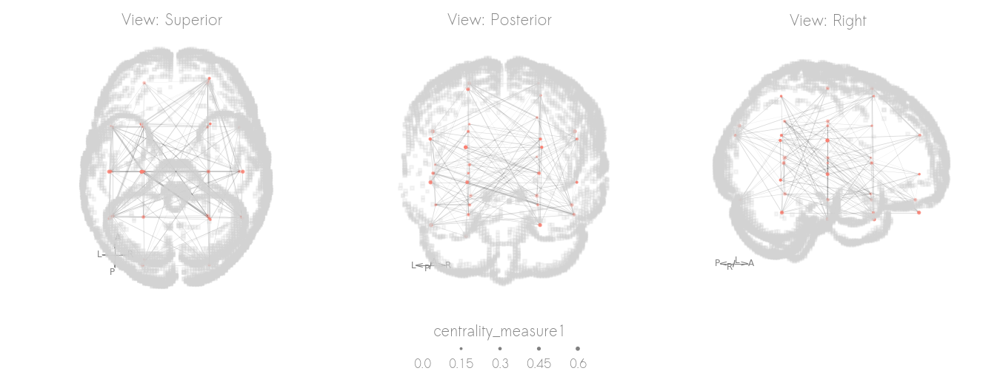

# NetOnBrain: visualizing networks on a brain

A package to create simple 3D network visualizations with a brain background.

(Name is a work in progress)


## Installation

`pip install git+https://www.github.com/wiheto/netonbrian`

For now until pip is set up.

## How it works

There are three key components: (1) the nodes, (2) the edges, (3) the background template

### For the nodes

You need a pandas dataframe of nodes. The dataframe should have (at least) the columns 'x', 'y', and 'z'.
These columns should be coordinates in the space of the template (e.g. MNI).
Other columns can be used to style the node's colour and size.

### For the edges

Edges as a numpy array (adj matrix) or as a pandas dataframe (edgelist) with the columns 'i', 'j', and 'weight' (optional).

### For the template

For the template you can supply any nifti file.
However, you can just provide the template name for any template on templateflow.org.
The T1w brain mask will then automatically downloaded (if not already present on your computer) and used as the background.

## Template Styles

There are currently two background styles: "filled" and "glass".

The filled style, plots the template's brain mask as voxels.

The glass style, tries to identify the outline of the mask.
The glass style is quicker, but the edge detection is run relative to the specified initial view of the plot.

For both templates, you can change the voxelsize of the template. Larger voxels means the plot will be generated quicker

## Views

The view can be a string:

- Left 'L',
- Right 'R',
- Anterior 'A',
- Posterior 'P'
- Dorsal 'D'
- Ventral 'V'
- Specific rotation (tuple): (xy-rotate, xz-rotate) in degrees. The R view is (0, 0)

## Rotated view sequences

You can also generate a sequence of rotated images.

If the view is two letters, LR, then a sequence will be generated from the L-view to R-view.
The parameter frames will dictate how many images are generated.
Images will then be displayed along a single row.

## Minimal examples

### Generate some simple data

```python
import numpy as np
import netonbrain as nob
import pandas as pd
import matplotlib.pyplot as plt

np.random.seed(2021)

# 8 psudeorandom xyz coordinates
nodex = np.array([42, -42, -40, 40, 12, -12, -18, 18])
nodey = np.array([-60, -60, 40, 40, 56, 56, -44, -44])
nodez = np.array([30, 30, -16, -16, 35, 35, 44, 44])
# Some psuedo_centrality measure to demonstrate size
centrality = np.array([30, 30, 50, 15, 20, 10, 5, 25])
nodes = pd.DataFrame(data={'x': nodex, 'y': nodey, 'z': nodez, 'centrality': centrality})

n = 8 # number of nodes
m = 12 # number of edges
# Random edges connecting the 8 nodes
ind = np.triu_indices(n, k=1)
eon = np.random.permutation(len(ind[0])) 
edges = np.zeros([n, n])
edges[ind[0][eon[:m]], ind[1][eon[:m]]] = 1
edges += edges.transpose()
```

### Plot single view

```python
nob.plot(template='MNI152NLin2009cAsym', templatestyle='glass',
                    view='R', 
                    nodes=nodes, nodesize='centrality',
                    edges=edges)
plt.show()
```


### Plot different styles

```python
nob.plot(template='MNI152NLin2009cAsym', templatestyle='filled',
                    view='R', 
                    nodes=nodes, nodesize='centrality',
                    edges=edges)
plt.show()
```


```python
nob.plot(template='MNI152NLin2009cAsym', templatestyle='glass',
                    view='R', 
                    nodes=nodes, nodesize='centrality',
                    edges=edges)
plt.show()
```


### Plot sequence

```python
nob.plot(template='MNI152NLin2009cAsym', templatestyle='glass',
                    view='RP', 
                    nodes=nodes, nodesize='centrality',
                    edges=edges, frames=3)
plt.show()
```


## Get involved? 

We hope to develop this package.
Please feel free to get in touch about what feature you want/would like to implement/would like to contribute to.

## Features to be added. 

- Dynamicly place origin of arrows based on view.
- Dynamicly choose which arrows are shown 
- Direction of rotation RP+ or RP- should go different ways.
- Add lists of directions ['AP+', 'DL-']
- Surfaces.
- More and improved template styles.
- Colouring.
- Edge properties.
- Areas as nodes
- Simple node selection
- Scaling
- Nodes spheres
