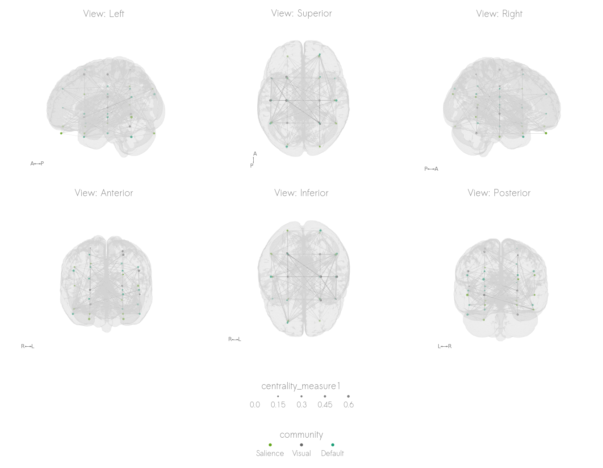
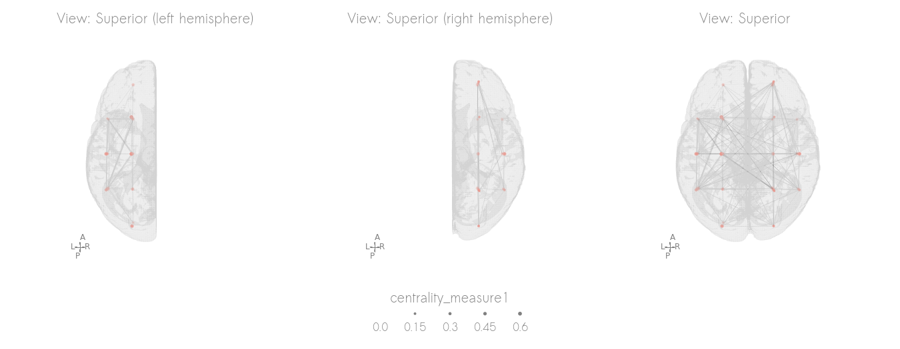
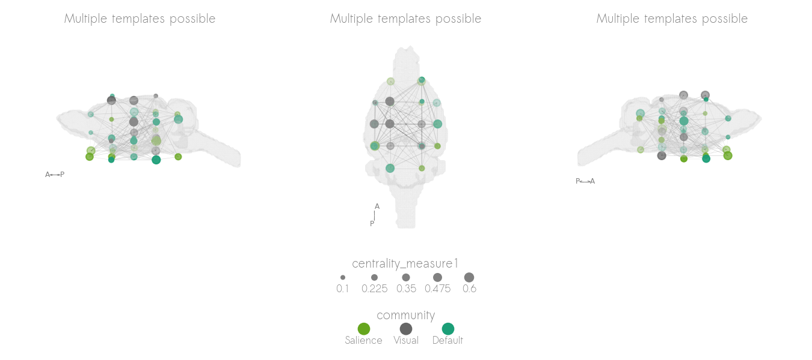

# netplotbrain: visualizing networks on a brain

Painlessly plot networks on a brian in python.


## Features

1. Easy to specify properties: integration with pandas entails node and edge size/colour can easily be specified. 
2. Flexibility: multiple node and template styles. Easily create multiple angles to view the figure. 
3. [TemplateFlow](https://www.templateflow.org) integration to download any template or atlas.

## Installation

`pip install git+https://www.github.com/wiheto/netplotbrain`

## How it works

There are three components: (1) the nodes, (2) the edges, (3) the template

Each component functions independently.
You do not need to have all of them specified.

## Nodes

There are two ways to specify nodes.

1. Nodes: a pandas dataframe of cordinates
2. Nodeimg: a 3D nifti image where each node has a different value.
Alternatively, nodeimg can be dictionary to grab an atlas from templateflow.

### Nodes (Dataframe)

The Pandas dataframe should have(at least) the columns 'x', 'y', and 'z'.
These columns should be coordinates in the space of the template(e.g. MNI).
It will look something like this. 

| x       | y     | z     |
| :-------------:  | :----------: | :-----------: |
|  40     | 50    | 20    |
| -10     | 40    | 30    | 

Other columns can be used to style the node's colour and size.
These just become other columns in the dataframe.

| x       | y     | z     | communities | degree_centrality |
| :-------------:  | :----------: | :-----------: | :----------: | :-----------: |
|  40     | 50    | 20    | 1    | 0.8
| -10     | 40    | 30    | 1    | 0.4

With this information, you can easily specify colour and size arguments by specifying the column name:

```netplotbrain.plot(..., nodecolor='communities')```

These additional values to specify size and color can be given as a dataframe even
if you specify your nodes with a nifti image.

### Nodeimg (Nifti image)

You can also input a 3D nifti image where each node is a unique value.

### Nodeimg (Templateflow atlas)

If you specify the key/value pairs of an atlas on templateflow in a dictionary,
the atlas will be automatically downloaded. 
For example, the following will get the Schaefer2018 atlas.

```python
nodeimg={'template': 'MNI152NLin2009cAsym',
         'atlas': 'Schaefer2018',
         'desc': '400Parcels7Networks',
         'resolution': 1}
```

See templateflow.org for more atlases. 

If the template argument is specified in `netplotbrain.plot`,
then the template argument does not need to be included in the dictionary.

## Edges (dataframe)

Edges as a numpy array (adj matrix) or as a pandas dataframe(edgelist) with the default columns 'i', 'j', and 'weight' (optional). An example: 

| j       | j     | weight     |
| :-------------:  | :----------: | :-----------: |
|  0     | 1    | 0.8    |
|  1     | 2    | 0.5    | 

`i` and `j` reference the indicies in . You can use the argument `edgecol` to specify different column names.

If numpy array, then the array should be a N x N array (where N is number of nodes).

## Template (nifti or string)

For the template you can supply any nifti file.

You can also provide the template name for any template on templateflow.org.
The T1w brain mask will then automatically downloaded(if not already present on your computer) and used as the background.

Netplotbrain can render slightly different templates 

### Template Styles

There are currently three background styles: "surface", "filled" and "cloudy".

The surface, quickly renders a surface from the voxels. Additional arguments can be provided in order to the resolution of the surface.

The filled style, plots the template's brain mask as voxels. This can be slightly RAM consuming.

The cloudy style, tries to identify the outline of the mask and plots points along the edges. The cloudy style is quick, but the edge detection is run relative to the specified initial view of the plot.

For templates, you can change the voxelsize of the template. Larger voxels means the plot will be generated quicker.

## Views

The view is the angle which the brain is viewed from in the plot.
You can specify it as a string:

- Left 'L',
- Right 'R',
- Anterior 'A',
- Posterior 'P'
- Superior 'S'
- Inferior 'I'

Sequences of views are possible.
So setting view = 'LSR' will generate 3 subplots with left, superior, and right views

You can also specify the specific rotation(tuple): (xy-rotate, xz-rotate) in degrees. The R view is (0, 0)

### Rotated sequences with frames

You can also generate a sequence of rotated images.

If the view is two letters, (e.g. `'LR'`), then a sequence will be generated from the L-view to R-view.

The parameter `frames` will controle how many images are generated.
Images will then be displayed along a single row.

If you specify a list(e.g. `['LR', 'AP']`) then two different rows will be generated.
The first, from left to right. The second from anterior to posterior.

## Minimal examples

# Generate some random data for examples

```python

import numpy as np
import netplotbrain
import pandas as pd
import matplotlib.pyplot as plt
# Set random seed
np.random.seed(2021)

def create_random_data(n, m, xlim, ylim, zlim):
    """
    Function to generate random data

    n, m : number of nodes (n) and edges (m)
    xlim, ylim, zlim : coordinate limites for random data
    """
    # CREATE THE NODES
    # 8 psudeorandom xyz coordinates
    X = np.random.uniform(xlim[0], xlim[1], n)
    y = np.random.uniform(ylim[0], ylim[1], n)
    z = np.random.uniform(zlim[0], zlim[1], n)
    # Some random centrality measures to demonstrate size
    centrality_measure1 = np.random.binomial(10, 0.3, n) / 10
    centrality_measure2 = np.random.binomial(10, 0.6, n) / 10
    nodesdf = pd.DataFrame(data={'x': X, 'y': y,
                            'z': z, 'centrality_measure1': centrality_measure1,
                            'centrality_measure2': centrality_measure2})
    ## CREATE THE EDGES.
    # Randomly selet edges 
    ind = np.triu_indices(n, k=1)
    eon = np.random.permutation(len(ind[0]))
    edges = np.zeros([n, n])
    # Generate some random wieghts between 0 and 1
    weights = np.random.binomial(10, 0.25, m) / 10
    edges[ind[0][eon[:m]], ind[1][eon[:m]]] = weights
    # Make symetrical
    edges += edges.transpose()
    return nodesdf, edges
    

n = 10  # number of nodes
m = 20  # number of edges

nodes, edges = create_random_data(n, m, [-50, 50], [-90, 60], [-40, 50])    
```

# Plot single view

```python
netplotbrain.plot(template='MNI152NLin2009cAsym',
                  templatestyle='surface',
                  view='R',
                  nodes=nodes,
                  nodesize='centrality',
                  edges=edges)
plt.show()
```


## Specify column names to specify size

```python
fig = plt.figure()
ax_centrality = fig.add_subplots(projection='3d')
netplotbrain.plot(template='MNI152NLin2009cAsym',
                  templatestyle='surface',
                  fig = fig,
                  ax = ax_centrality,
                  view='R',
                  nodes=nodes,
                  nodesize='centrality',
                  nodecolor='blue',
                  edges=edges)

ax_betweenness = fig.add_subplots(projection='3d')
netplotbrain.plot(template='MNI152NLin2009cAsym',
                  templatestyle='surface',
                  fig = fig,
                  ax = ax_betweenness,
                  view='R',
                  nodes=nodes,
                  nodesize='betweenness',
                  nodecolor='blue',
                  edges=edges)
plt.show()
```


## Plot multiple rows

```python
netplotbrain.plot(template='MNI152NLin2009cAsym',
                  templatestyle='surface',
                  nodes=nodes,
                  nodesize='centrality',
                  edges=edges,
                  view=['LSR', 'AIP'],
                  frames=2)
plt.show()
```


## Plot atlas (as nodes) from templateflow

```python
netplotbrain.plot(nodeimg={'atlas': 'Schaefer2018',
                            'desc': '400Parcels7Networks',
                            'resolution': 1},
                  template='MNI152NLin2009cAsym',
                  templatestyle='surface',
                  view=['LSR'],
                  nodetype='circles')
plt.show()
```


## Plot different templates


## plot atlas (as parcels) from templateflow

```python
netplotbrain.plot(nodeimg={'atlas': 'Schaefer2018',
                            'desc': '400Parcels7Networks',
                            'resolution': 1},
                  template='MNI152NLin2009cAsym',
                  templatestyle=None,
                  view=['LSR'],
                  nodetype='parcels',
                  nodealpha=0.5,
                  nodecolor='Set3')
plt.show()
```


## Plot individual hemispheres

```python
netplotbrain.plot(template='MNI152NLin2009cAsym',
                  templatestyle='surface',
                  view=['SSS'],
                  hemisphere=['L', 'R', ''],
                  nodes=nodesdf,
                  nodesize='centrality_measure1',
                  edges=edges)
```


## Plot different templates

```python
# Generate data for WHS
xlim = [-6, 6]
ylim = [-10, 6]
zlim = [-3, 6]
nodes_whs, edges_whs = create_random_data(n, m, xlim, ylim, zlim)

# Setting templatevoxsize to 0.2 will make it slightly quicker
# Due to the voxel size being smaller, the nodes are currently smaller
# So scaling the nodes is useful.  
netplotbrain.plot(template='WHS',
         templatestyle='surface',
         view='LSR',
         nodes=nodes_whs,
         nodesize='centrality_measure1',
         edges=edges_whs,
         nodescale=10,
         templatevoxsize=0.2)

plt.show()
```



## Plot different styles

```python
netplotbrain.plot(template='MNI152NLin2009cAsym',
                  templatestyle='filled',
                  view='R',
                  nodes=nodes,
                  nodesize='centrality',
                  edges=edges)
plt.show()
```


```python
netplotbrain.plot(template='MNI152NLin2009cAsym',
                  templatestyle='cloudy',
                  view='R',
                  nodes=nodes,
                  nodesize='centrality',
                  edges=edges)
plt.show()
```


# Get involved?

We hope to develop this package.
Please feel free to get in touch about what feature you want/would like to implement/would like to contribute to.

# Features to be added.

- Dynamicly choose which arrows are shown
- Colouring.
- Edge properties.
- Simple node selection
- Scaling
