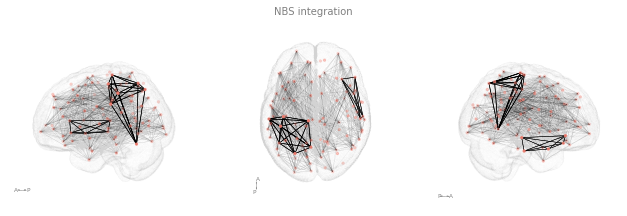

# Gallery

## Simple Figures

### A single view

[Source Code](./simple/)

## High level interface

[Source Code](./gallary/highlevel_size/)

## Visualization alternatives

## Dual row figures

[Source Code](./gallary/two_rows/)

## Integrations

### [Network based statistics (via bctpy) integration](./nbs/)

## Templateflow Atlases

## TemplateFLow Templates

### MNIInfant 

[Source Code](./infant/)

### WHS (rat)

[Source Code](./whs/)

