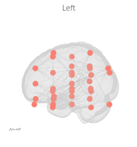
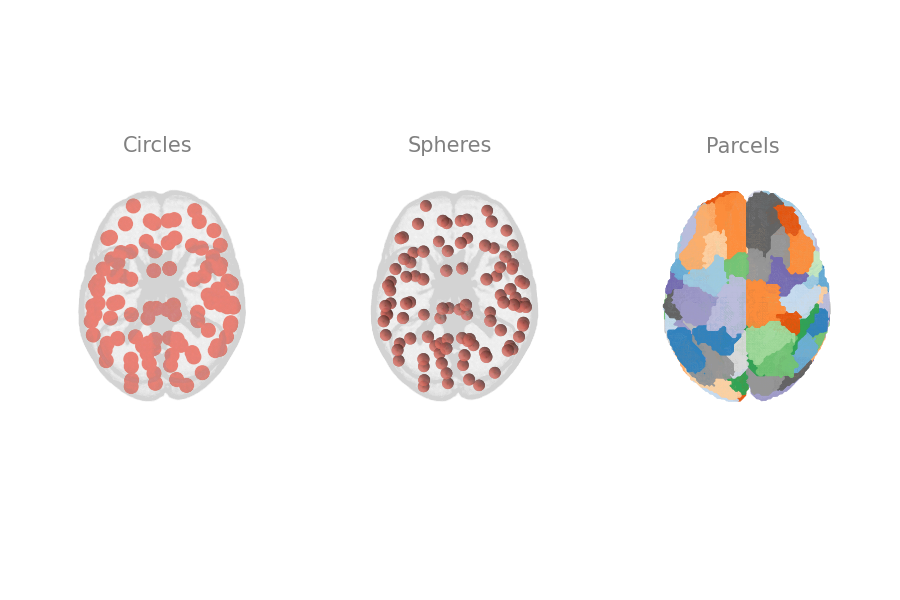
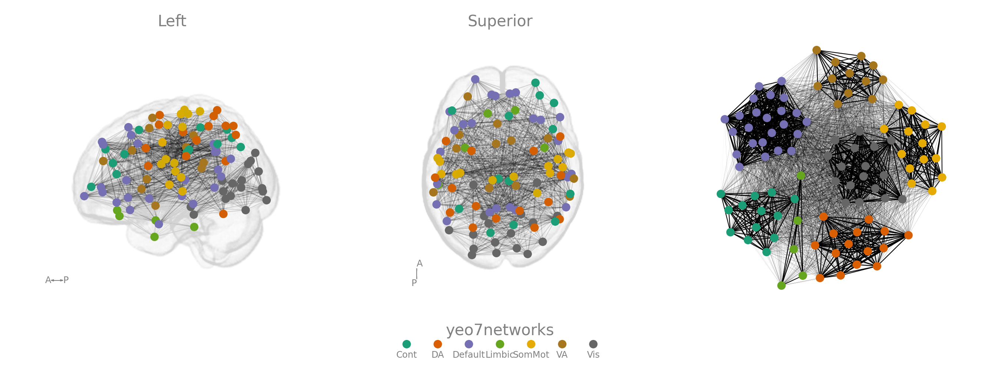

# Gallery

## Simple Figures

### [A single view]((./simple/))

## Visualization alternatives

### [Node styles](./node_styles/)

### [Node colours](./specifying_node_color/)

### [Specifying colormaps](./node_cmap/)

### [Dual row figures](./two_rows/)

### [Highlight a network](./two_rows/)

## Integrations

### [Include spring layout subplots](./spring_layout/)

### [Network based statistics (via bctpy) integration](./nbs/)

## Templateflow Atlases

## TemplateFLow Templates

### [MNIInfant](./infant) 

### [WHS](./infant) 

