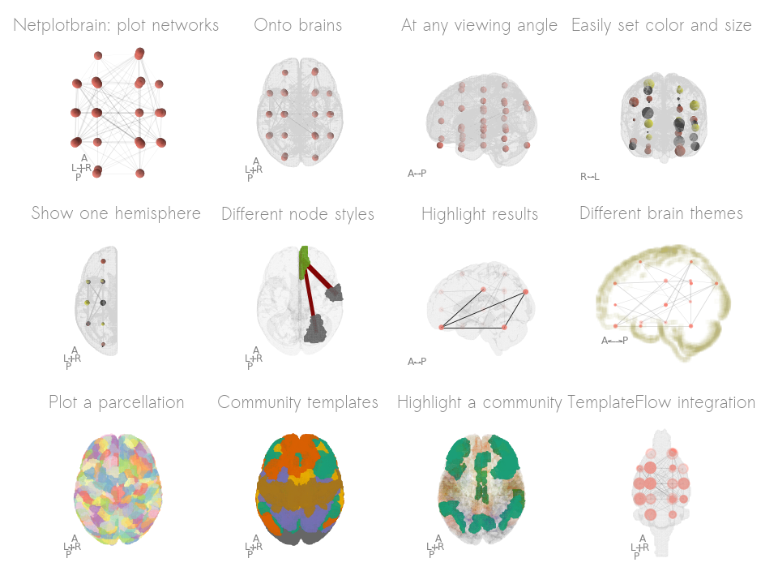

# netplotbrain: visualizing networks in 3D on a brain

Painlessly plot networks on a brain in python. The package is still in early development and better documentation/tutorials/examples are in the works.

## Features

1. Easy to specify properties: integration with pandas entails node and edge size/colour can easily be specified.
2. Flexibility: multiple node and template styles. Easily create multiple angles to view the figure.
3. [TemplateFlow](https://www.templateflow.org) integration to download any template or atlas.

## Installation

`pip install git+https://www.github.com/wiheto/netplotbrain`

